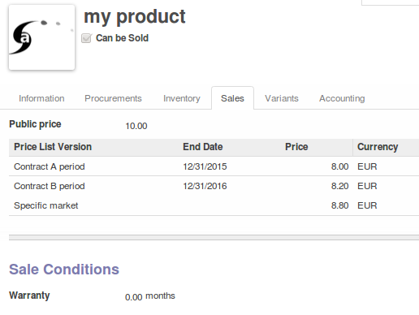

.. image:: https://img.shields.io/badge/licence-AGPL--3-blue.svg
   :target: http://www.gnu.org/licenses/agpl-3.0-standalone.html
   :alt: License: AGPL-3

=====================
Pricelist Per Product
=====================

This module allows to see and edit all sale prices on product form

Configuration
=============

* Sales / Customer feature :
  check "Use pricelists to adapt your price per customers"
* Menu Sales / Configuration / Pricelist Versions
  Check Product Price Grid field in your pricelists of your choice

.. image:: static/description/pricelist.png

Usage
=====

* Go to the product form (Sales tab): add a Price version

* Menu Sales / Configuration / Pricelist Versions

.. image:: https://odoo-community.org/website/image/ir.attachment/5784_f2813bd/datas
   :alt: Try me on Runbot
   :target: https://runbot.odoo-community.org/runbot/135/8.0

Known issues / Roadmap
======================

Mass update of prices in not the object of this module.

Credits
=======

Contributors
------------

* David BEAL <david.beal@akretion.com>
* Sylvain CALADOR <sylvain.calador@akretion.com>

Maintainer
----------

.. image:: http://odoo-community.org/logo.png
   :alt: Odoo Community Association
   :target: http://odoo-community.org

This module is maintained by the OCA.

OCA, or the Odoo Community Association, is a nonprofit organization whose mission is to support the collaborative development of Odoo features and promote its widespread use.

To contribute to this module, please visit http://odoo-community.org.
