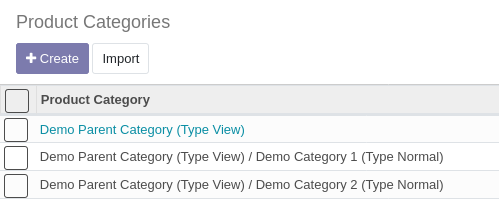
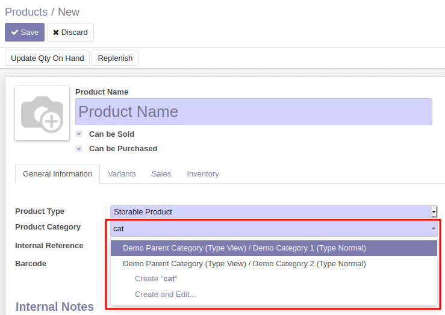

Add 'Type' field on Product Categories to distinguish between parent and
final categories.

- Categories (type view) can contain only categories.
- Categories (type normal) can contain only products.

It is so impossible to select a category (type view) in the product
template form view.

## Note

This module restores a feature that was present in Odoo Community
Edition until the V10 revision.

Ref:
<https://github.com/odoo/odoo/blob/10.0/addons/product/models/product.py#L24>
