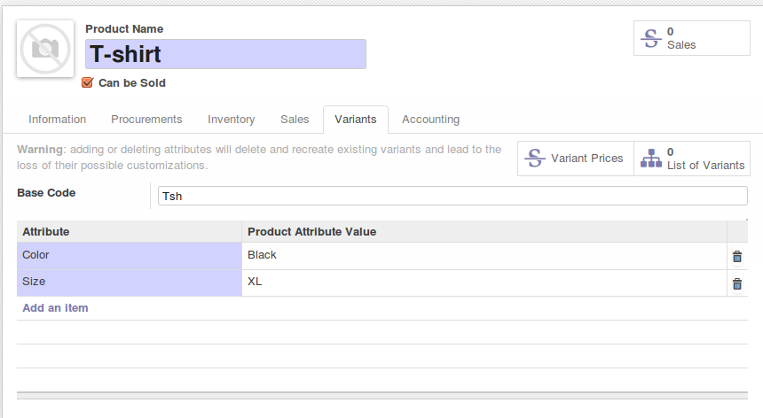
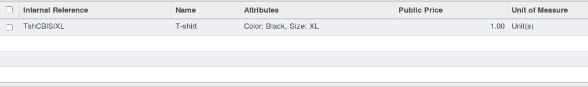

.. image:: https://img.shields.io/badge/licence-AGPL--3-blue.svg
 :alt: License: AGPL-3

Product Code Builder
====================

This module was written to automatically create default_code using a base code

For example :

with our module we can create code of T-shirt in the form : TshCoBLSiXL

Credits
=======

Contributors
------------

* Benoît GUILLOT <benoit.guillot@akretion.com>
* Abdessamad HILALI <abdessamad.hilali@akretion.com>
* Graeme Gellatly <g@o4sb.com>

Maintainer
----------

.. image:: http://odoo-community.org/logo.png
 :alt: Odoo Community Association
 :target: http://odoo-community.org

This module is maintained by the OCA.

OCA, or the Odoo Community Association, is a nonprofit organization whose
mission is to support the collaborative development of Odoo features and
promote its widespread use.

To contribute to this module, please visit http://odoo-community.org.
