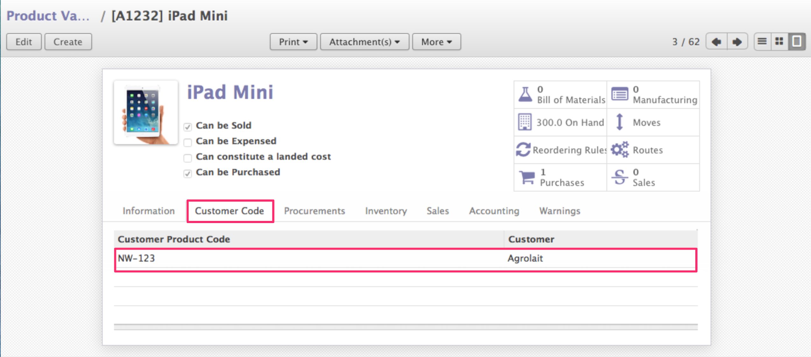
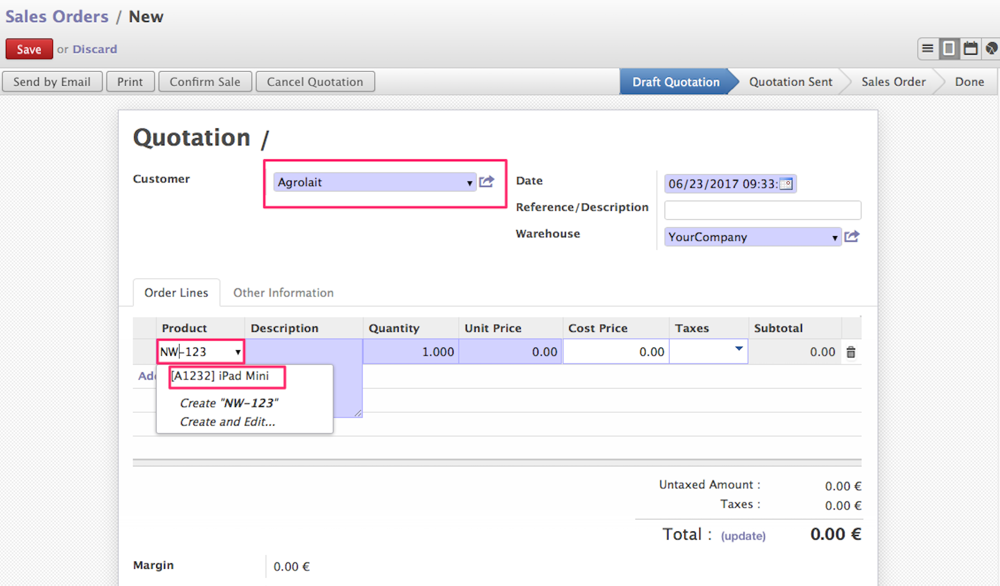
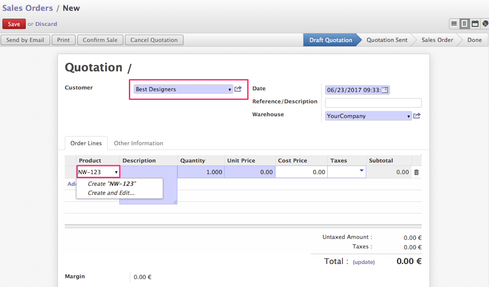

.. image:: https://img.shields.io/badge/licence-AGPL--3-blue.svg
   :target: http://www.gnu.org/licenses/agpl-3.0-standalone.html
   :alt: License: AGPL-3

=====================
Product customer code
=====================

This module extends of module product and allows to have different codes
for the same product according to the customer.

Installation
============

To install this module, you need:

- Not special pre-installation is required, just install as a regular Odoo
  module:

  - Go to ``Settings > Module list`` search for the current name and click in
    ``Install`` button.

Usage
=====

To use this module, you need:

- Go to product and configure code for each selected customer.

- When add order lines in sale quotation for a customer that has an specific
  code in the product, you can search that product with customer code.

- If product does not have a configuration for customer selected, product will
  be search by its default code.

You can see the behavior described above in the following video:

.. figure:: http://img.youtube.com/vi/CkePQmYZMMc/hqdefault.jpg
    :target: https://www.youtube.com/embed/CkePQmYZMMc
    :figwidth: 60%
    :align: center

Credits
=======

Contributors
------------

* Julio Serna Hernández <julio@vauxoo.com>
* Yennifer Santiago <yennifer@vauxoo.com>
* Moisés López <moylop260@vauxoo.com>

Maintainer
----------

.. image:: https://odoo-community.org/logo.png
   :alt: Odoo Community Association
   :target: https://odoo-community.org

This module is maintained by the OCA.

OCA, or the Odoo Community Association, is a nonprofit organization whose
mission is to support the collaborative development of Odoo features and
promote its widespread use.

To contribute to this module, please visit https://odoo-community.org.
