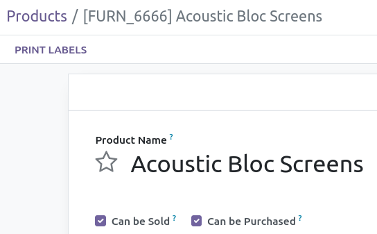

This module displays the product name in English near the products name in user's language.

Use case:
The Product name is very important information at least if you buy products in a foreign country.
It often occurs that in an odoo instance the product names don't match with their translations.
This module can help to detect those translation errors.

.. figure:: ../static/description/screen_french.png
    :alt: Display the product name in English near the product name in users language

