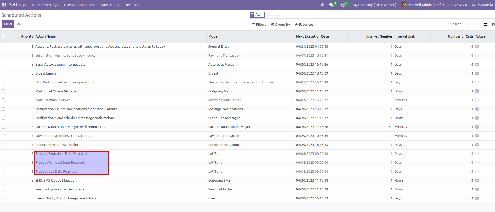

- To configure a times on categories, Go to Configuration menu (in
  Purchase/Invoicing/Inventory), then Product Categories.
- Choose the one you want to configure and fill in the times and the Use
  Expiration Date:

- To configure activities crons, go to Settings \> Technical \>
  Scheduled Actions
- Choose the one you want to activate and configure the time to run it

