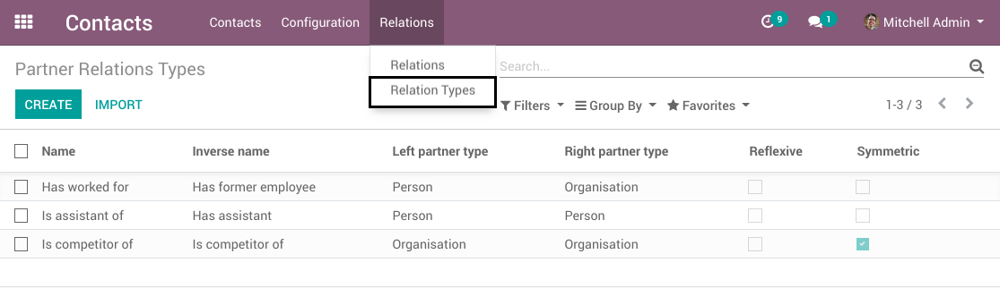
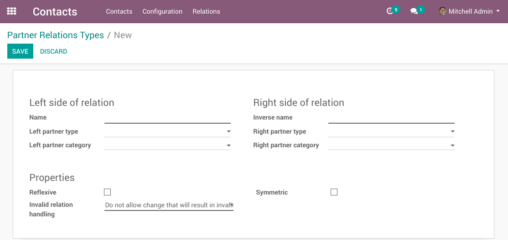
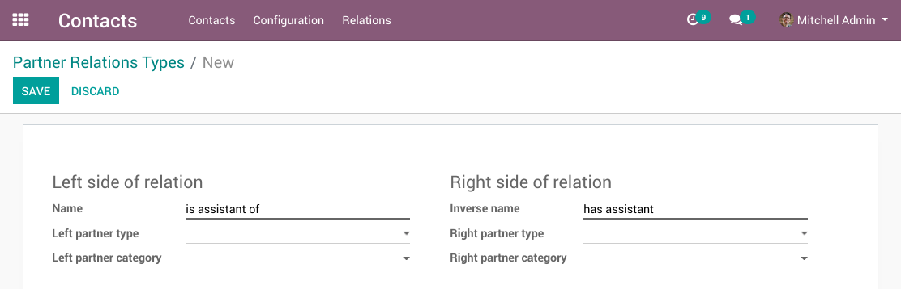
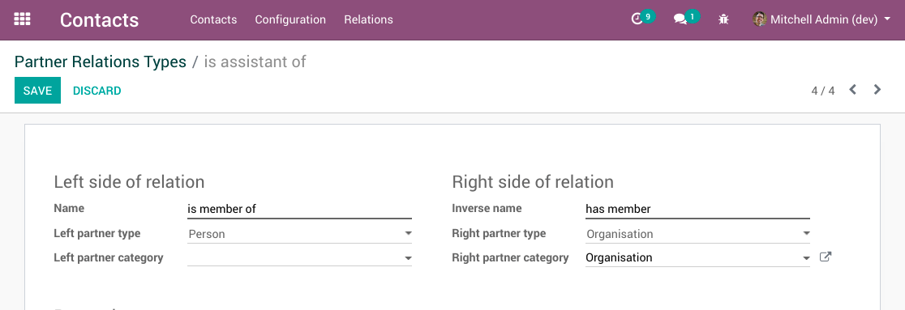
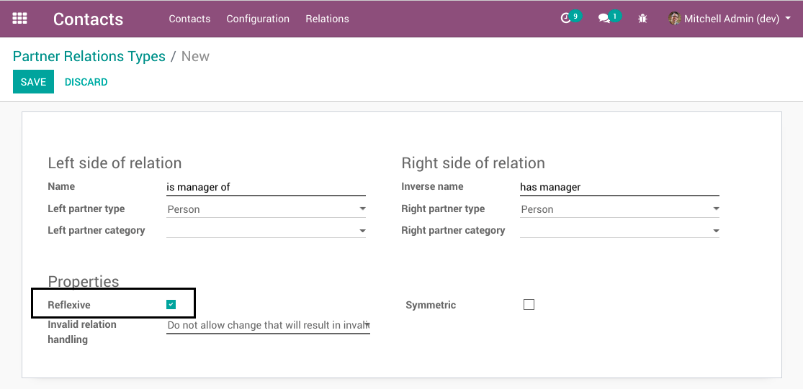
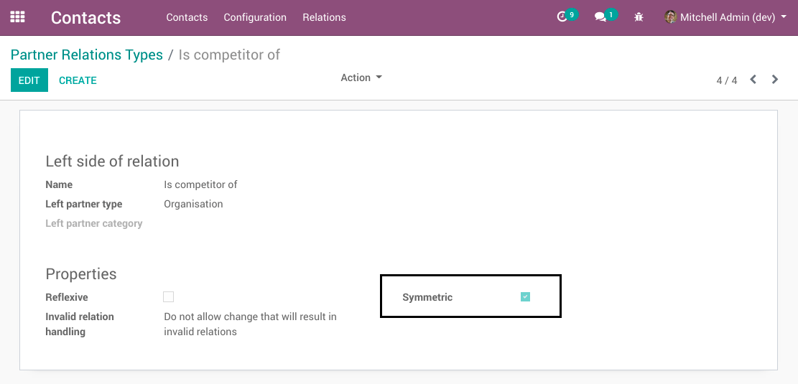
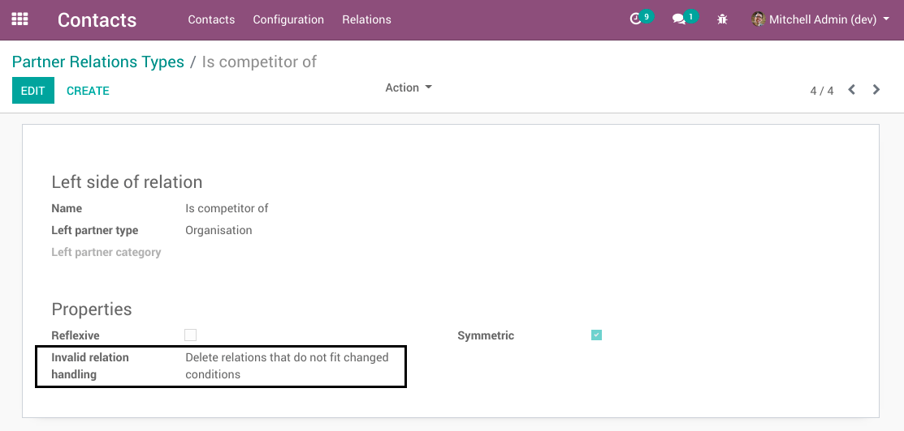
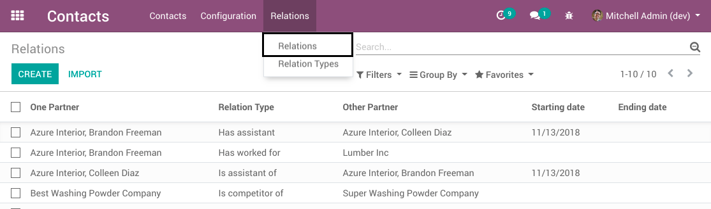
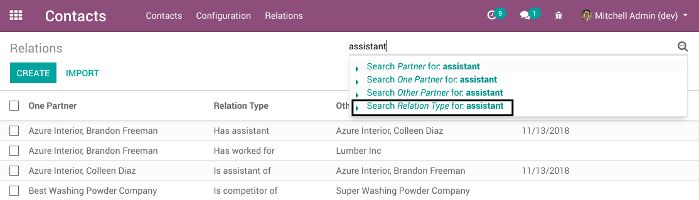
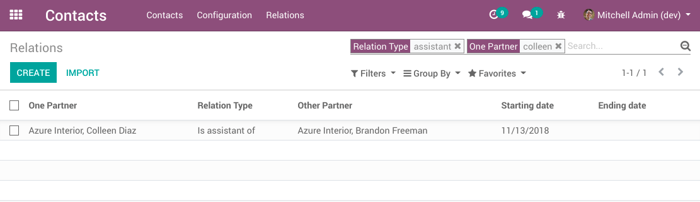

Relation Types
~~~~~~~~~~~~~~

Before being able to use relations, you'll have define some first.
Do that in Products / Relations / Product relations.

A relation type has a name for both sides.

To have an accessory-relation, you would name one side 'has accessory' and the other side 'is accessory of'.

Product Types
~~~~~~~~~~~~~

The `Product Type` fields allow to constrain what type of products can be used
on the left and right sides of the relation.

* In the example above, the accessory-relation only makes sense between products, so you would choose 'Consumable' for both product types.

.. image:: ../static/description/relation_type_form_product_type_filled.png

* A relation 'is supported by' should have Consumables on the left side and Services on the right side.

If you leave these fields empty, the relation is applicable to all types of products.

Product Categories
~~~~~~~~~~~~~~~~~~

You may use categories to further specify the type of products.

You could for example enforce the 'has spare part' relation to accept only products with the category 'Spare parts' on the right side.

Reflexive
~~~~~~~~~

A reflexive relation type allows a product to be in relation with itself.

No real example comes to mind in this case :-)

Symmetric
~~~~~~~~~

A symetric relation has the same meaning from the left and right sides.

For example, in a 'is alternative to' relation, both products represent
alternative to each other. 

Invalid Relation Handling
~~~~~~~~~~~~~~~~~~~~~~~~~

When the configuration of a relation type changes, some relations between 2 products may become invalid.

For example, if the left product type is set to `Service` and a relation already exists with a Consumable on the right side,
that relation becomes invalid.

What happens with invalid relations is customizable on the relation type.

4 possible behaviors are available:

* Do not allow change that will result in invalid relations
* Allow existing relations that do not fit changed conditions
* End relations as of today, if they do not fit changed conditions
* Delete relations that do not fit changed conditions

Searching Products With Relations
~~~~~~~~~~~~~~~~~~~~~~~~~~~~~~~~~

To search for existing relations, go to `Products / Relations / Relations`.

To find all alternatives in your database, fill in 'alternative' and
autocomplete will propose to search for this type of relation.

Now if you want to find accessories of Machine, you fill in 'Machine' and one of the proposals
is to search for products having a relation with Machine.

Searching Relations From Product View
~~~~~~~~~~~~~~~~~~~~~~~~~~~~~~~~~~~~~

A smart button is available on the product form view to display the list of relations.

.. image:: ../static/description/product_form_view_smart_button.png

.. image:: ../static/description/product_form_view_smart_button_2.png
