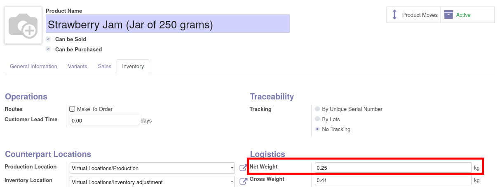

- Go to 'Inventory \> Master Data \> Product' and edit items.
- Go to 'Inventory' tab, and fill the "Net Weight" value.

**Note**: The original weight field is renamed to "Gross Weight", to be
more explicit.
