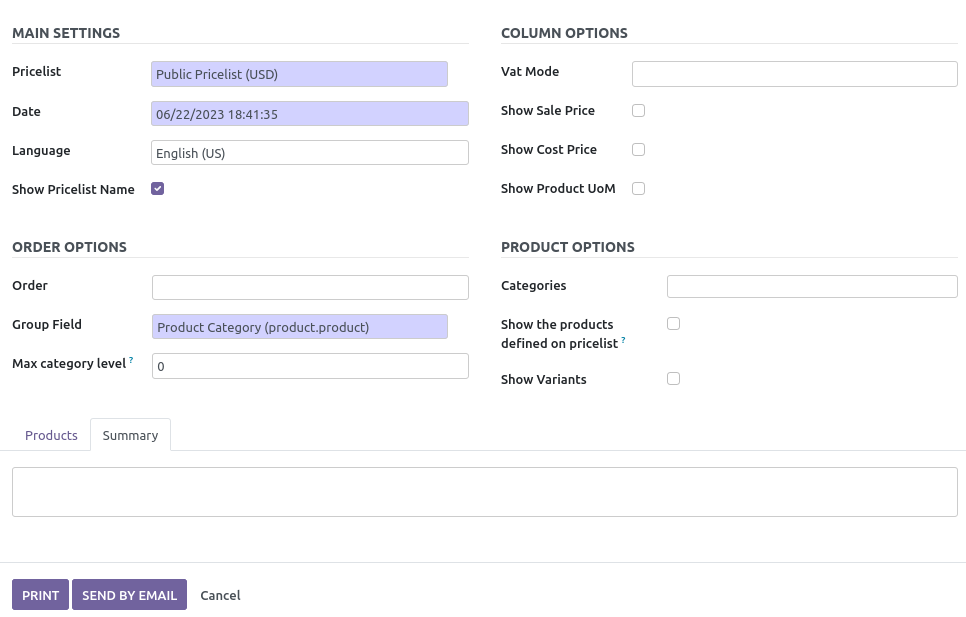

To use this module, you have several options:

1.  Go to *Sales \> Products \> Print Price List*

2.  Go to *Sales \> Products \> Products*  
    - Select products in list view
    - Press *Action \> Price List*

3.  Go to *Sales \> Products \> Product Variants*  
    - Select products in list view
    - Press *Action \> Price List*

4.  Go to *Sales \> Orders \> Customers*  
    - Select customers in list view
    - Press *Action \> Send customer pricelist by EMail*

