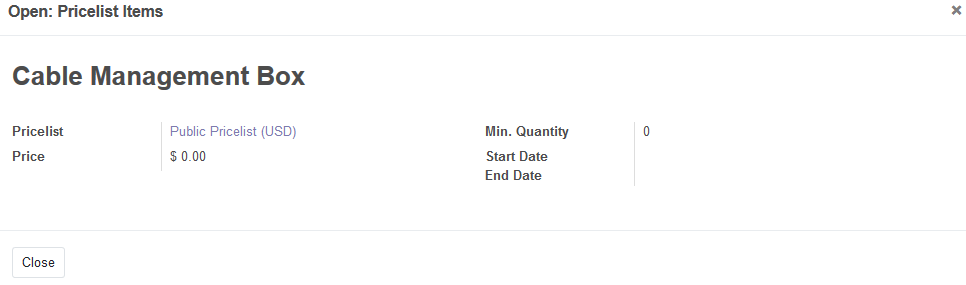

In a product form, before addon installation, when enabled pricelist items management, the pricelist tree and form looks like this, e.g. for a discount entry:

After installation, tree and view forms shows the same and complete information that pricelist menu does:

