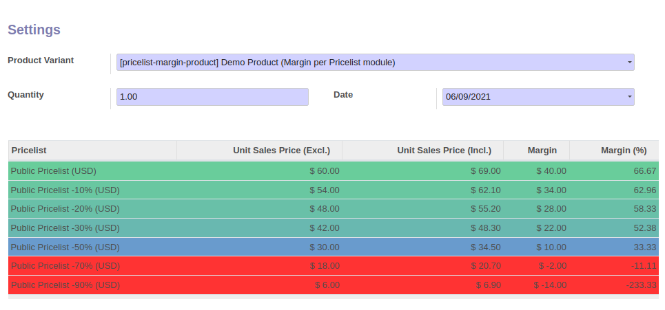

**Lazy Dependency**

If you install the extra module ``web_tree_dynamic_colored_field``,
present in the OCA repository (https://github.com/OCA/web),
the lines will have a background, depending on the final margin.

* the greener the line, the greater the margin
* the bluer the line, the greater the margin
* In case of negative margin, the line is red

