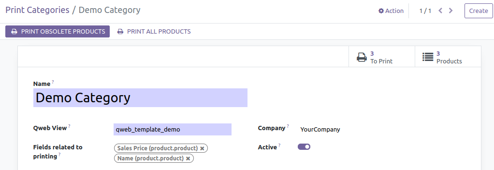
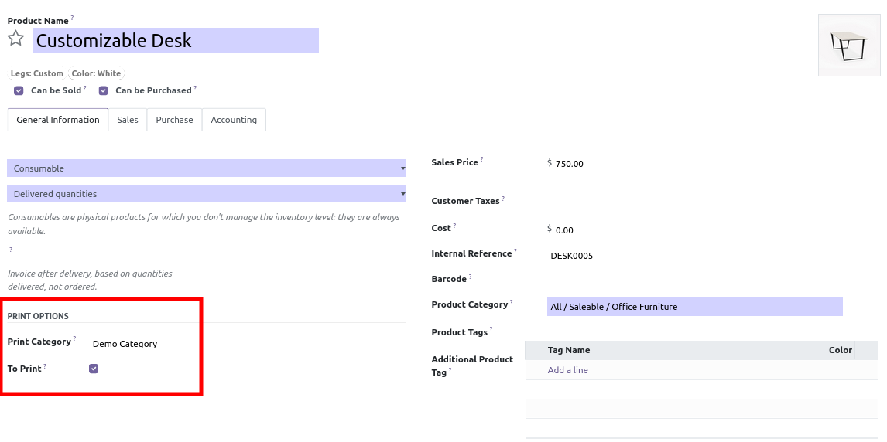
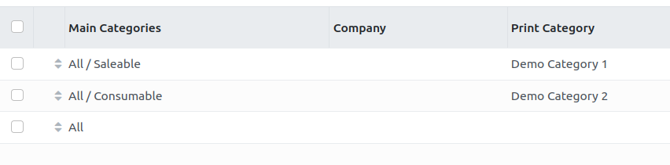

**Group setting**

- Add yourself to the 'Print Category Manager' group in the 'Pricetags'
  category.

**Create Print Categories**

- Go to 'Sales' \> 'Products' \> 'Print Categories'

- Find or create new print categories of products  
  - Set the fields that will trigger to print again the product label
    (e.g : name, sale price etc.)
  - Set the qweb view that will be used for this category

Alternatively, you can create product print categories and qweb in a
custom module.

**Affect products to the categories**

- Go to "Sales" \> "Products" \> "Product variants" (or "Products" if
  variants are not activated).
- Go to your product in General Information tab
- Set a print category

**Create Print Category Rules**

- Go to 'Sales' \> 'Products' \> 'Print Category Rules'

Create various ordered rules depending on product category and company.

This system allow to automatically set / remove print category to a
product, when changing its company or its category.

