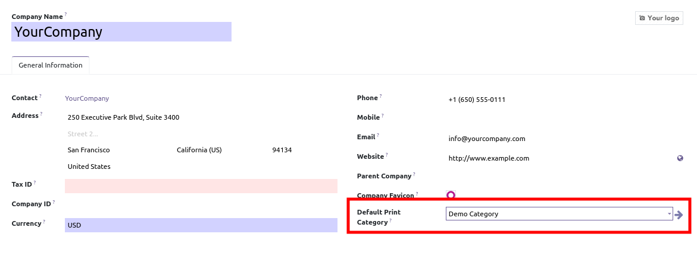

**To affect products to the categories**

* Go to "Sales" > "Products" > "Product variants" (or "Products" if
  variants are not activated).
* Go to your product in General Information tab
* Set a print category

.. figure:: ../static/description/product_product_form.png

* You can set a default print category in res_company configuration settings
   For each new product, it will be assigned to the print category.

**To print your products**

* Go to "Sales" > "Products" > "Print Categories"
* Choose between "Print Obsolete Products" or "Print All Products"

.. figure:: ../static/description/product_print_wizard_form.png

* Alternatively you can select product in product or variants list view and click
  on "Action" > "Print Products"
