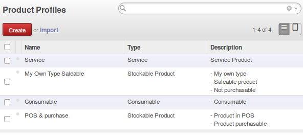

.. image:: https://img.shields.io/badge/licence-AGPL--3-blue.svg
    :alt: License: AGPL-3

Product Profile
===============

This module was written to make products configuration easier (in one click).
It allows to configure a product template with only one field.

.. image:: static/description/field.png

**Main use case**: a lot of modules are installed (mrp, purchase, sale, pos)
and products configuration becomes harder for end users: too many fields to take care of.

You are concerned that at any time a product might be not configured correctly: this module is your friend.

In this case a lot of complexity becomes hidden (default behavior) to the end user and usability is optimal.

It also can make ease the data migration by only specifying the profile field instead of all fields which depend on it.

Note: This module is meant to be used by skilled people in database fields creation with the ERP framework.


Configuration
=============

* Create your own profile here: Sales > Configuration > Product Categories and Attributes > Product Profiles




* To have more fields available to attach to this profile you must define these fields in the model 'product.profile' in your own module
  If the field name (and its type) is the same than those in 'product.template' then values of these will be populated automatically in 'product.template'
  Example of fields declaration in your own module:
  ```
class ProductProfile(models.Model):
    """ Require dependency on sale, purchase and point_of_sale modules
    """

    _inherit = 'product.profile'

    def _get_types(self):
        return [('product', 'Stockable Product'),
                ('consu', 'Consumable'),
                ('service', 'Service')]

    sale_ok = fields.Boolean(
        string='Can be Sold',
        help="Specify if the product can be selected in a sales order line.")
    purchase_ok = fields.Boolean(
        string='Can be Purchased')
    available_in_pos = fields.Boolean()
  ```

* Insert data (xml or csv) and define values for each field defined above for each configuration scenario


Usage
=====

Assign a value to the profile field in the product template form.
Then, all fields which depend on this profile will be set to the right value at once.

If you deselect the profile value, all these fields will be reset to empty values.

Install **Product Profile Example** module to see a use case in action.


Known issues / Roadmap
======================


Credits
=======

Contributors
------------

* David BEAL <david.beal@akretion.com>


Iconography
-----------

https://www.iconfinder.com/icondesigner


Maintainer
----------

.. image:: http://odoo-community.org/logo.png
   :alt: Odoo Community Association
   :target: http://odoo-community.org

This module is maintained by the OCA.

OCA, or the Odoo Community Association, is a nonprofit organization whose
mission is to support the collaborative development of Odoo features and
promote its widespread use.

To contribute to this module, please visit http://odoo-community.org.
