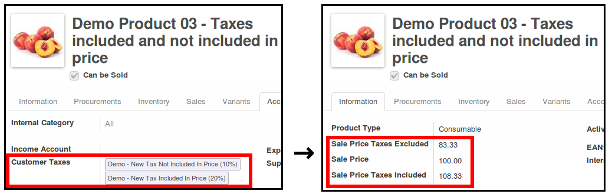

This module permits to quickly see the different prices of a product : price with taxes and price without taxes.

The four use cases
------------------

In Customer taxes, there's a boolean called "Tax included in Price".

**According to the customer taxes** of the product (choosen in accouting part), there are 4 possibilities :

- The sale price **AND** the sale price without taxes are displayed.

- **Or** the sale price **AND** the sale price with taxes.

- **Or** if you choose two customer taxes, one included in price, and the other
  one not included in price, this module displays the sale price and the two
  calculated prices.

- **And lastly** if there's no taxe choosen, only the normal price is displayed.

.. image:: ../static/description/product_no_tax.png
   :alt: A product with a unique sale price
   :width: 75%
