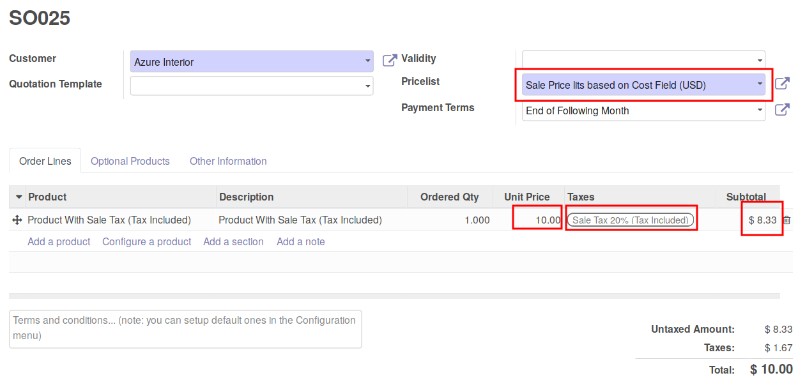
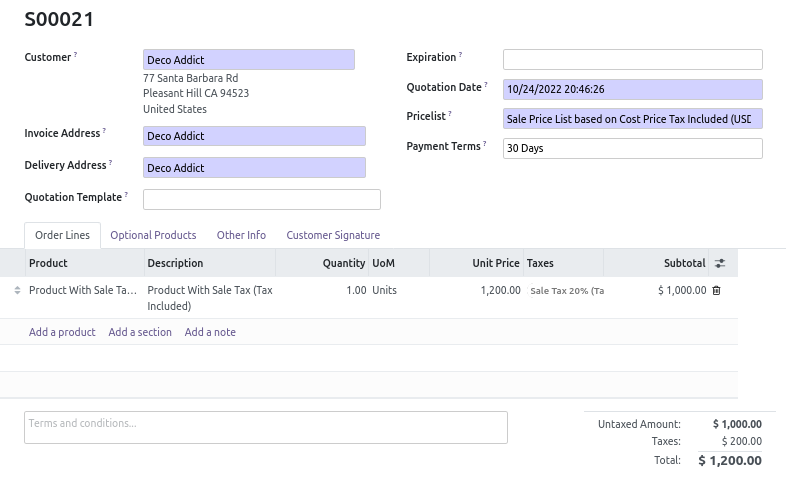

this module extend Odoo Sale module to handle correctly the possibility to
create and use pricelist **based on the cost Price**, if you are in a B2C
configuration (VAT set with 'Price Tax inlude').

If you don't use VAT price tax Included, this module is useless.

**Typical Use Case**

You have a product :
- Cost : 1000€ (Vat Excl)
- Sale Price (Vat incl) : 2400€
- VAT : 20% (Price with Tax included)

You have a marginless pricelist based on the cost

Without this module, if you create a sale order, the price will be bad, and
you will sale under your cost price.

With this module installed, the price will be good and you will not loose
the vat amount, when you realize this sale:

This module fixes the problem,

* adding a new computed field
  'Cost Price Tax Included' (``standard_price_tax_included``) on
  Product Product model, based on Cost Price Field and Sale Taxes Setting.

* adding a new key ``standard_price_tax_included`` on the field ``base`` of
  the model ``product.pricelist.item``.
