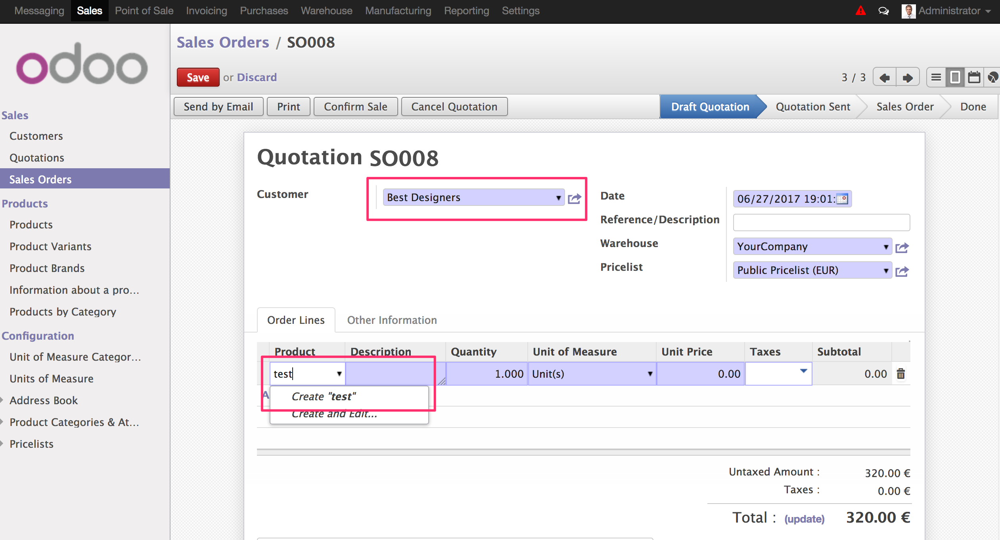
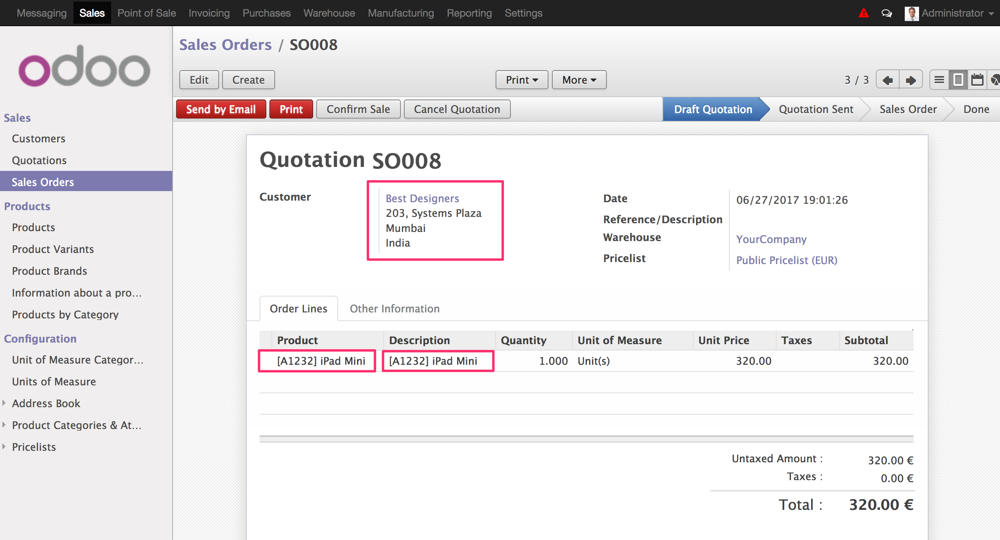

.. image:: https://img.shields.io/badge/licence-AGPL--3-blue.svg
    :alt: License: AGPL-3
    :target: http://www.gnu.org/licenses/agpl-3.0.en.html

==========================================
Product supplier info for customers - Sale
==========================================

This module extends of module *Product supplier info for customers* and allows
use the product codes and product name configured in each products in sale
orders.

Installation
============

Installing the module sale and product_supplier_info_for_customer this module
will be installed.

Usage
=====

To use this module, you need:

- Go to product and configure *Partner product name* and *Partner product code*
  for each selected customer.

.. figure:: static/description/configuration_customer.png
    :alt: Configure customer codes
    :width: 600 px

- When add order lines in sale quotation for a customer that has an specific
  name and code in the product, you can search that product with that customer
  name or code. Then, this values will be displayed in product description.

.. figure:: static/description/search_code.png
    :alt: Search by exist customer code
    :width: 600 px

.. figure:: static/description/description_code.png
    :alt: Search by exist customer code
    :width: 600 px

- If product does not have a configuration for customer selected, product will
  be search by its default code.

Credits
=======

Contributors
------------
* Moisés López <moylop260@vauxoo.com>
* Yennifer Santiago <yennifer@vauxoo.com>
* Julio Serna Hernández <julio@vauxoo.com>
* Deivis Laya <deivis@vauxoo.com>

Maintainer
----------

.. image:: https://odoo-community.org/logo.png
   :alt: Odoo Community Association
      :target: https://odoo-community.org

This module is maintained by the OCA.

OCA, or the Odoo Community Association, is a nonprofit organization whose
mission is to support the collaborative development of Odoo features and
promote its widespread use.

To contribute to this module, please visit https://odoo-community.org.
