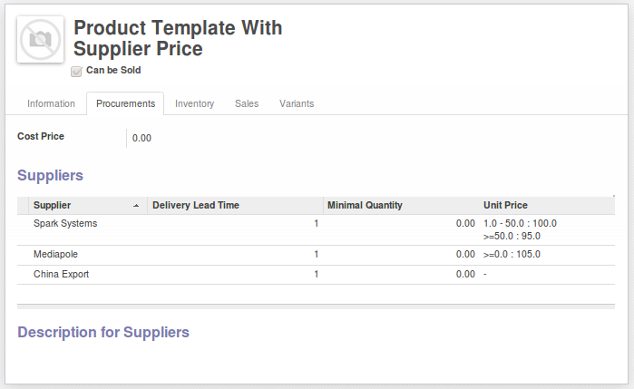

.. image:: https://img.shields.io/badge/licence-AGPL--3-blue.svg
    :alt: License: AGPL-3

Supplier Unit Price on Product Form
===================================

By default, On the product form, in the suppliers tab, you have to click on the
line to get the prices of the product from that supplier.

This module displays the unit price directly on the product form by adding a
function field to store the unit price to the supplierinfo object and adding
it to its tree view.

Screenshot
==========

Bug Tracker
===========

Bugs are tracked on `GitHub Issues <https://github.com/OCA/product-attribute/issues>`_.
In case of trouble, please check there if your issue has already been reported.
If you spotted it first, help us smashing it by providing a detailed and welcomed feedback
`here <https://github.com/OCA/product-attribute/issues/new?body=module:%20product_with_supplier_unit_price%0Aversion:%208.0%0A%0A**Steps%20to%20reproduce**%0A-%20...%0A%0A**Current%20behavior**%0A%0A**Expected%20behavior**>`_.

Credits
=======

Contributors
------------

* Savoir-faire Linux
* Sylvain Le Gal (https://twitter.com/legalsylvain)

Maintainer
----------

.. image:: http://odoo-community.org/logo.png
    :alt: Odoo Community Association
    :target: http://odoo-community.org

This module is maintained by the OCA.

OCA, or the Odoo Community Association, is a nonprofit organization whose mission is to support the collaborative development of Odoo features and promote its widespread use.

To contribute to this module, please visit http://odoo-community.org.

