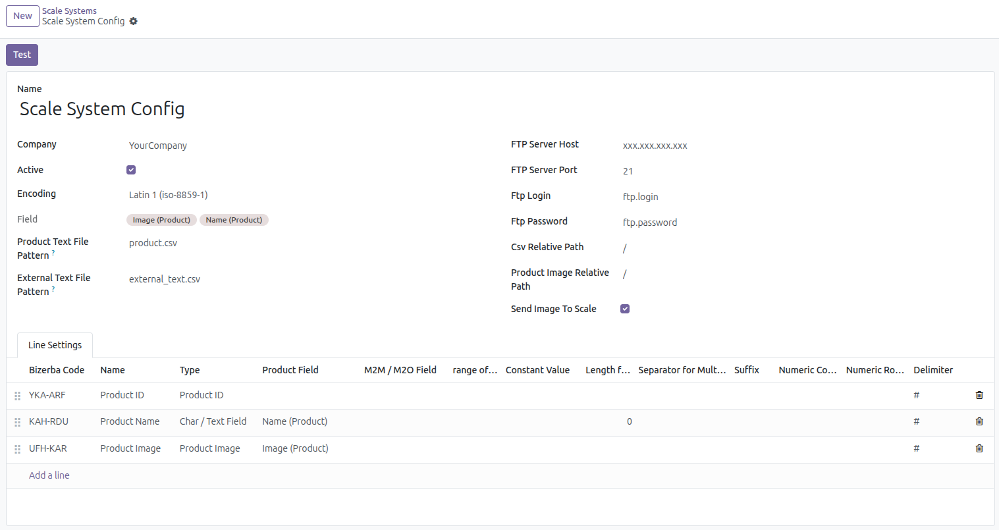

To configure this module, you need to:

**Configure Scale System**

1.  Go to the Sales > Configuration > Scale Systems.
2.  Create a system

For example:

**Scale Group**

1. Go to the Sales > Configuration > Scale Groups.
2. Create a group and link it to the previously created Scale System.

**Product to Scale Bizerba**

1. Go to Product Variants form view > Scale tab.
