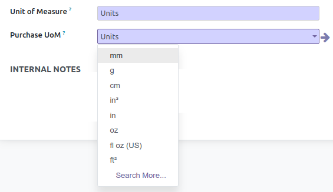
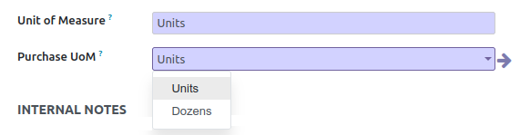

By default in Odoo, on the ``product.template`` and ``product.product`` form views, the list
of the available Purchase UoM is not filtered. (``uom_po_id`` field)

So the UI is proposing all the uoms, even those that are not consistent with the selected main UoM.
(defined in the ``uom_id`` field.)

This module extends the functionallity of product module, adding a domain on this field.

