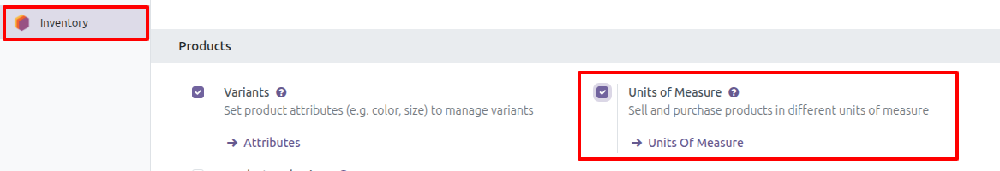

Enable unit of measure role
----------------------------

1. Go to Settings > Users & Companies > Users
2. Create or edit a user
3. Find the Manage Multiple Units of Measure role and select it
4. Save

  

Other option:

1. Go to Settings
2. Option Inventory
3. Find the option Units of Measure and select it
4. Save

  
