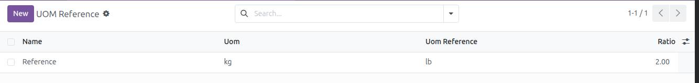
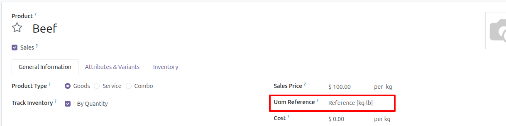
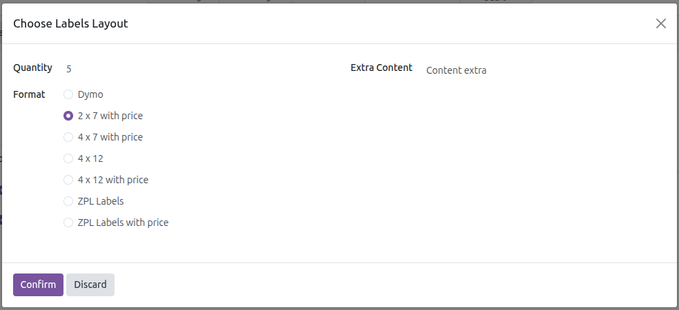
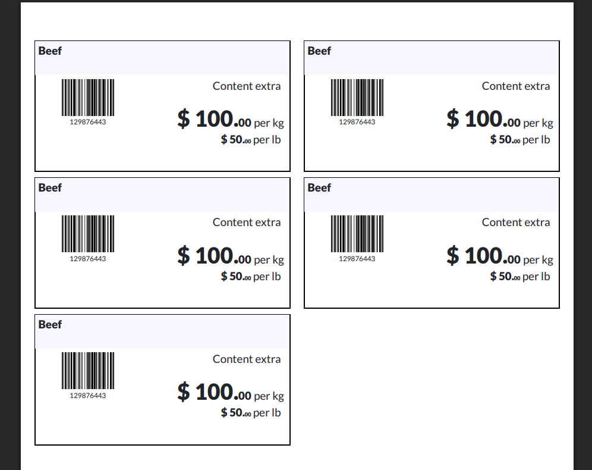
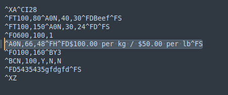

Add Uom Reference
----------------------------------------
1. Go to Inventory > Configuration > Product UOM Reference
2. Add a new item
3. Save

  

Configure Uom Reference in Product
-------------------------------------------
1. Go to Inventory > Products > Products
2. Create a new product
3. Select a reference unit. Note that only units whose initial unit of measurement
   matches the product's unit of measurement will be displayed
4. Save

  

Print labels with Uom Reference
-------------------------------------
1. Follow the steps [Configure Uom Reference in Product](#configure-uom-reference-in-product)
2. Press the Print labels button and select the type of label you want to print
3. Press the button Confirm
4. Upon confirmation, the product label is generated, in which the price of the reference unit
   is shown below the product price, taking into account the ratio configured in [Add Uom Reference](#add-uom-reference).

   Example:
    * Price based on initial unit of measure (kg): $100 per kg
    * Reference unit of measure ratio: 2.0
    * Price based on reference unit of measure (lb): $50 per lb

  

  

  
