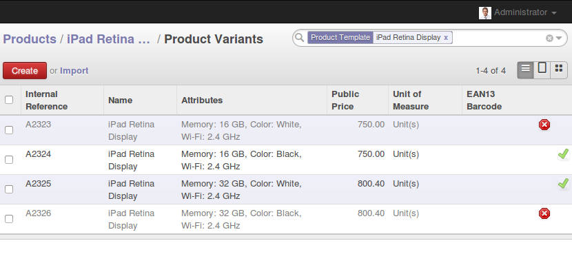

.. image:: https://img.shields.io/badge/licence-AGPL--3-blue.svg
   :target: http://www.gnu.org/licenses/agpl-3.0-standalone.html
   :alt: License: AGPL-3

========================
Product Variant Inactive
========================

This module extend the functionality of Product Variants
and allow you to make activate or deactivate products using the two buttons

Usage
=====

To use this module, you need to Product menu (Product Template)

On Variant tab, click on the button 'List of variants'

You can now activate or deactivate variants with button on the right side

.. image:: https://odoo-community.org/website/image/ir.attachment/5784_f2813bd/datas
   :alt: Try me on Runbot
   :target: https://runbot.odoo-community.org/runbot/135/8.0

Bug Tracker
===========

Bugs are tracked on `GitHub Issues
<https://github.com/OCA/product-attribute/issues>`_. In case of trouble, please
check there if your issue has already been reported. If you spotted it first,
help us smashing it by providing a detailed and welcomed `feedback
<https://github.com/OCA/product-attribute/issues/new?body=module:%20product_variant_inactive%0Aversion:%208.0%0A%0A**Steps%20to%20reproduce**%0A-%20...%0A%0A**Current%20behavior**%0A%0A**Expected%20behavior**>`_.

Credits
=======

Images
------

* Odoo Community Association: `Icon <https://github.com/OCA/maintainer-tools/blob/master/template/module/static/description/icon.svg>`_.

Contributors
------------

* Sebastien BEAU <sebastien.beau@akretion.com>
* Abdessamad HILALI <abdessamad.hilali@akretion.com>

Maintainer
----------

.. image:: https://odoo-community.org/logo.png
   :alt: Odoo Community Association
   :target: https://odoo-community.org

This module is maintained by the OCA.

OCA, or the Odoo Community Association, is a nonprofit organization whose
mission is to support the collaborative development of Odoo features and
promote its widespread use.

To contribute to this module, please visit https://odoo-community.org.

