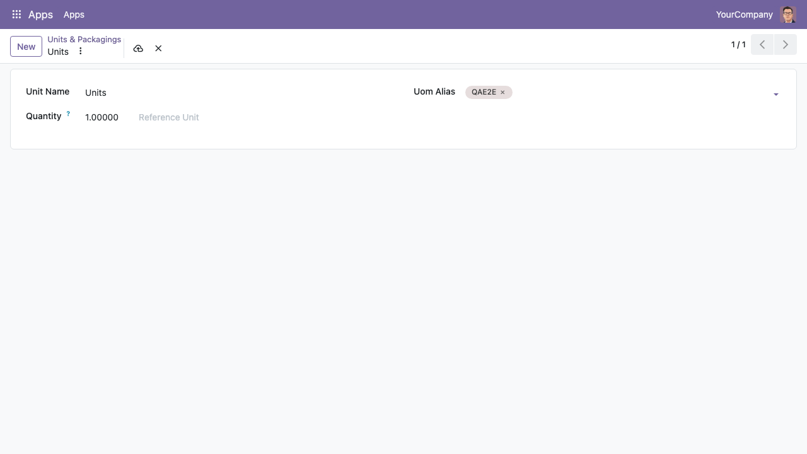

Enable **Units of Measure & Packagings** in the settings. Then open
*Inventory \> Configuration \> Products \> Units & Packagings* (or
*Purchase \> Configuration \> Units & Packagings*), open a unit of measure
and add one or more codes in the **Uom Alias** field.

