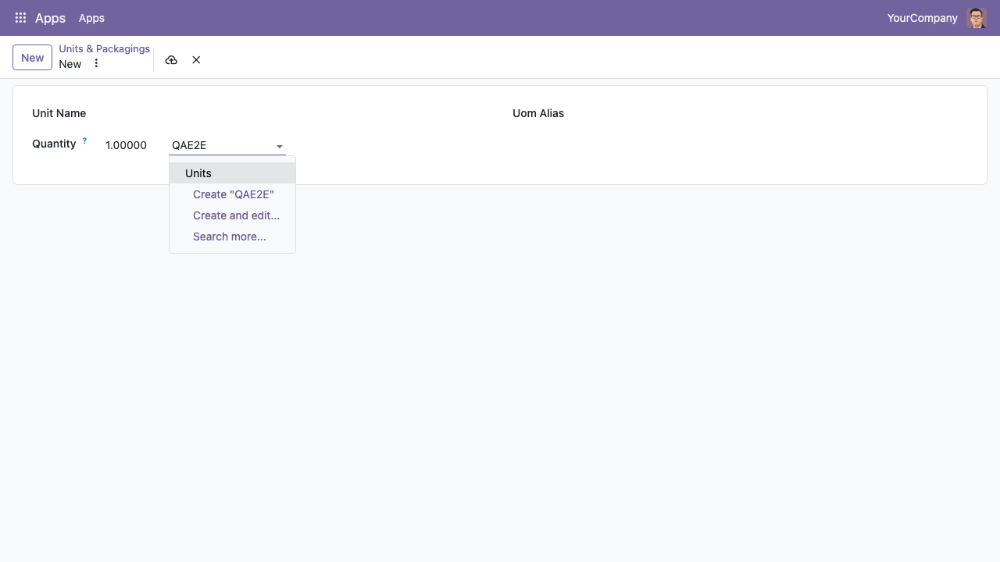

When you search for a unit of measure in any field, you can type its name or
one of its aliases. For example, with the alias `UND` on the unit *Units*,
typing `UND` suggests *Units*.

The alias is also found by `name_search`, which is what importers of supplier
documents use to match the unit written in the file.

